# THE CAVITY PREVENTION QUIZ

The Cavity Prevention Quiz is an educational game designed for people of all ages. An interactive quiz provides a learning experience for people to gain knowledge that can help them improve their oral health and maintain their smile.
The World Health Organisation in 2019 said that dental decay was the most common health condition in the world. Oral diseases disproportionally affect the poor and socially disadvantaged members of society. To provide real and meaningful change, we need health care systems that properly address these inequalities.
However, there are some straightforward actions that we as indiviuals can take that drastically reduce our risk of these problems. This resource is one way to spread the knowledge.

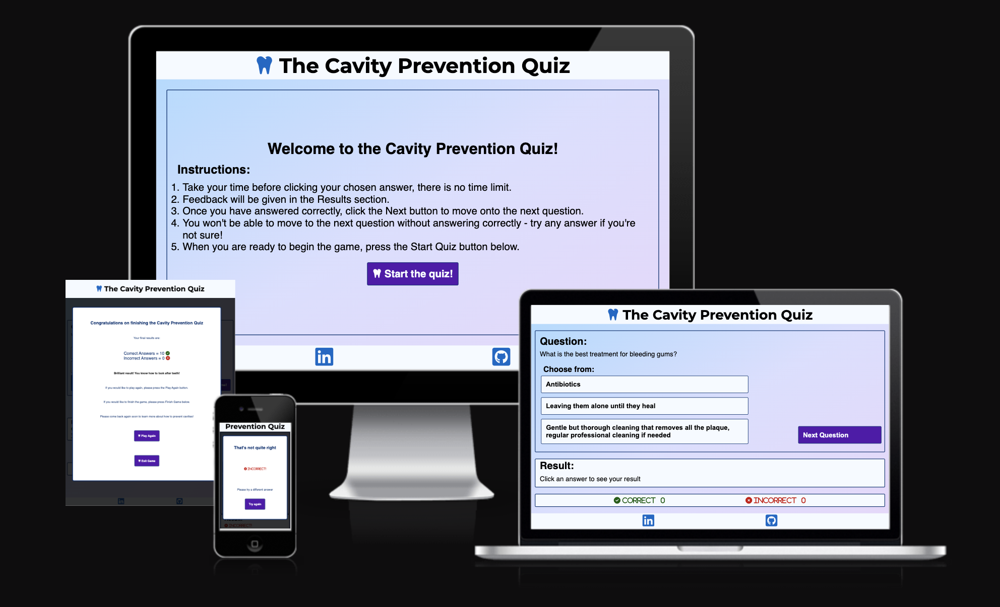

[View The Cavity Prevention Quiz on Github Pages](https://kellie-cat.github.io/dental-quiz/)

---

## CONTENTS

- [THE CAVITY PREVENTION QUIZ](#the-cavity-prevention-quiz)
  - [CONTENTS](#contents)
  - [User Experience (UX)](#user-experience-ux)
    - [Key information for the site](#key-information-for-the-site)
      - [Goals](#goals)
      - [First Time User Goals](#first-time-user-goals)
      - [Returning Visitor Goals](#returning-visitor-goals)
  - [Design](#design)
    - [Colour Scheme](#colour-scheme)
    - [Typography](#typography)
    - [Wireframes and Google Doc](#wireframes-and-google-doc)
  - [Features](#features)
    - [General features](#general-features)
      - [The Welcome Page](#the-welcome-page)
      - [The Quiz Page](#the-quiz-page)
    - [Future Implementations](#future-implementations)
    - [Accessibility](#accessibility)
  - [Technologies Used](#technologies-used)
    - [Languages Used](#languages-used)
    - [Frameworks, Libraries \& Programs Used](#frameworks-libraries--programs-used)
  - [Deployment \& Local Development](#deployment--local-development)
    - [Deployment](#deployment)
    - [Local Development](#local-development)
      - [How to Fork](#how-to-fork)
      - [How to Clone](#how-to-clone)
  - [Testing](#testing)
    - [Resolved Bugs](#resolved-bugs)
    - [Known Bugs](#known-bugs)
  - [Credits](#credits)
    - [Code Used](#code-used)
    - [Content](#content)
    - [Acknowledgments](#acknowledgments)

---

## User Experience (UX)

The Cavity Prevention Quiz is an interactive learning game played on one screen. It was designed using a mobile-first mindset and is interactive on larger screen sizes.

### Key information for the site

- A header with a title introducing the page and a logo.
- A welcome page with instructions for the new user and a button to commence playing.
- A quiz page with questions and multiple choice answers that submit and give feedback when pressed.
- A button to move onto the next question.
- A score tally area.
- A pop up at the end to give a final score and feedback and invite the user to refresh the game to play again.
- Links to find out more about me include my LinkedIn and GitHub profiles which open in a new tab.

#### Goals

- To have an interactive site that is responsive for screen sizes from handheld devices to larger monitors.
- To have a site that is intuitive and accessible both visually and for people using screen readers.
- To provide a learning experience that is useful to a wide range of people.
- To spread awareness about how to achieve dental health and oral comfort.
- By preventing dental issues, reduce the impact of dental disease on our community, health service and environment.
- To provide resources to find out more about me and other projects.

#### First Time User Goals

- I want to learn about dental diseases and the ways I can prevent them.
- I want to view the information in an aesthetically pleasing and intuitive way.
- I want to navigate around the site easily and get clear feedback.

#### Returning Visitor Goals

- I want familiarity that improves UX by creating an feeling of ease of use.
- I want to know how to contact the page to ask any questions I may have.

## Design

### Colour Scheme

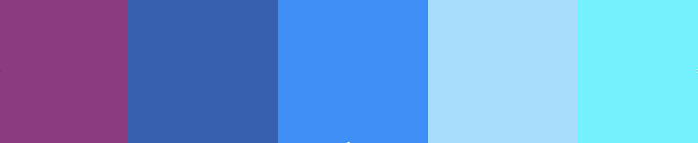

Dental environments often use a colour scheme of blue and white to convey calmness and cleanliness, so I started with that idea and looked for a popular palette on [Coolors](https://coolors.co/) that had some contrasting colours to provide visual separation.
However, I wanted a range of blues with enough lightness to provide contrast, and I wasn't finding any that I likes on the colour generators, so I made my own with [Art In Context](https://artincontext.org/color-palette-generator/).

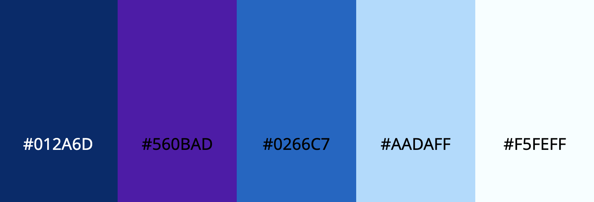

I then added some interest to the background with a pastel colour gradient.
As the contrast was not ideal with the very pale blue, I changed this to white.

### Typography

[Google Fonts](https://fonts.google.com/) was used for the fonts and [Font Pair](https://www.fontpair.co/all) helped pick a pair that complemented each other.
I decided to use a sans-serif font for the majority of the text for accessibility for screens.
A serif font gave some personality to the headings and added a feel of a traditional photo album.

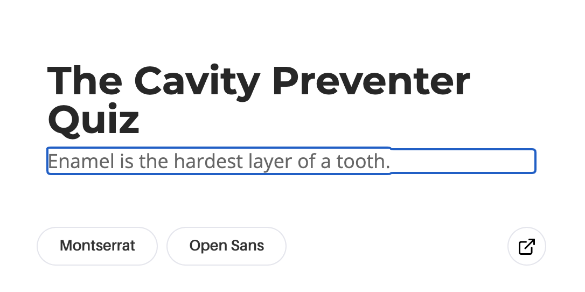

### Wireframes and Google Doc

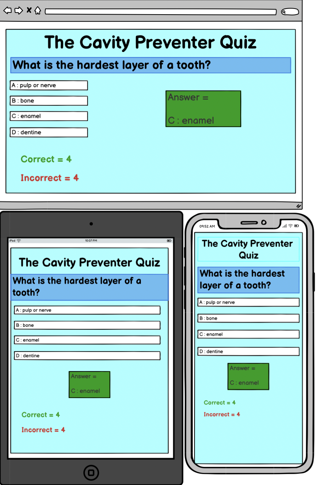
Balsamiq wireframes were trialed to plan the project layout.

## Features

### General features

The website has a landing page and a quiz page, built with a mobile-first mindset and responsive up to 3500px screen sizes.

#### The Welcome Page

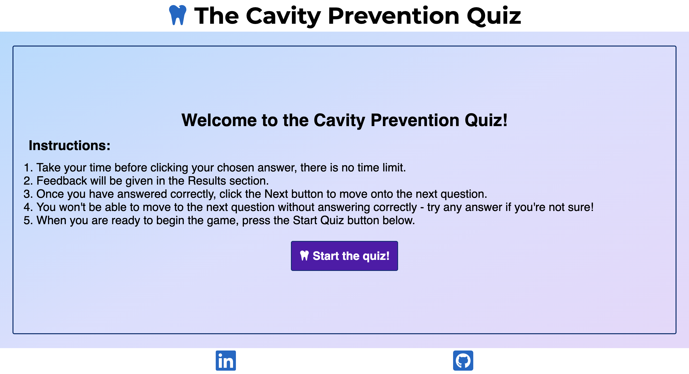

- When users first load the page, the home page is displayed to
  - welcome the user and introduce the game
  - explain the purpose of the game
  - provide instructions
  - begin the game with a start button
  - the header and footer are a constant throughout, with Font Awesome icons
  - the header has a tooth, setting the theme for the quiz
  - and the foooter has links to LinkedIn and GitHub, which open in a new tab, incase anyone would like to find out more about me

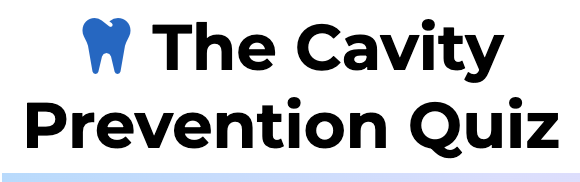

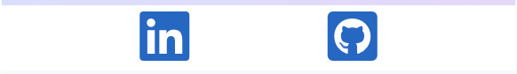

#### The Quiz Page

Again the header and footer appear, familiar to the user.
On this page, the header is also an anchor tag, linking the user back to the home page.

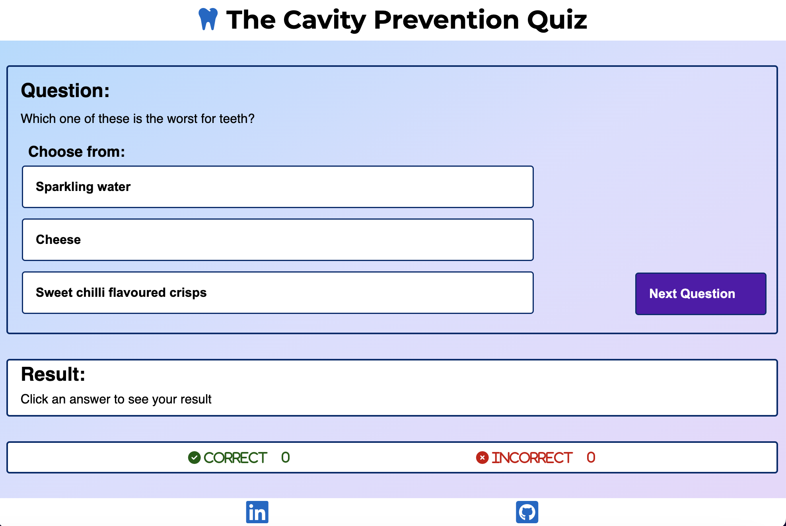

The majority of the page is the Game Area, containing

- a Question and Answer area
  - with 3 multiple choice answers contained in buttons
  - a different coloured button to move to the next page

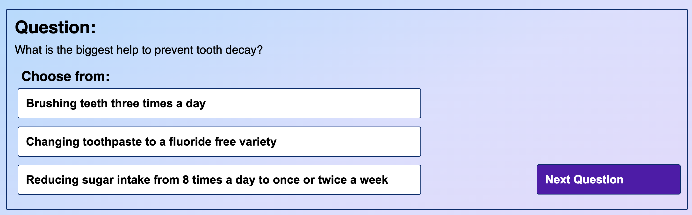

- a Feedback area which
  - tells the user if they got the question correct or incorrect
  - and when they answer correctly, an explaination of the correct answer appears
  
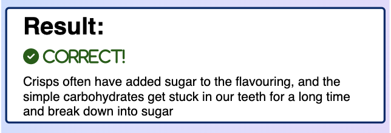

- if an incorrect answer is given then a window opens to warn the user that answer was not correct and a background container hides the quiz until the user closes the incorrect answer window
  
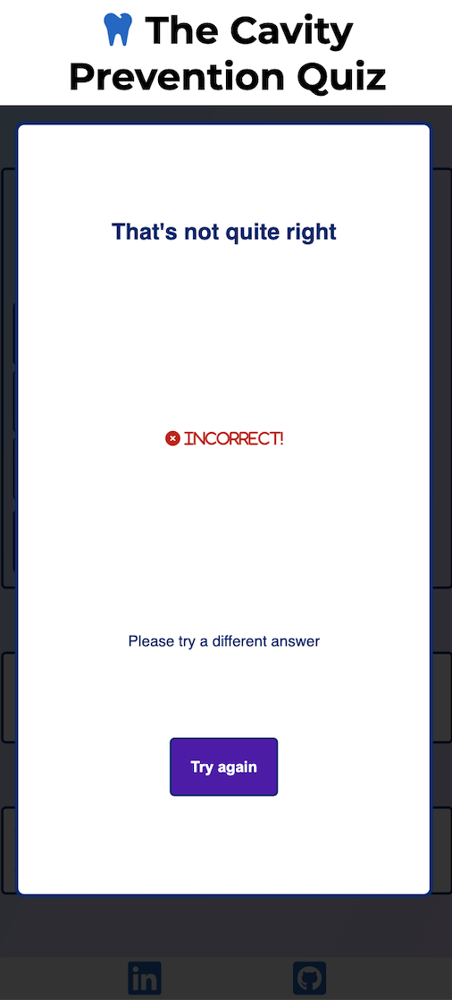

- if the user answers incorrectly, they cannot move onto the next question, becuase the aim of the game is to get information across. They have to keep trying until they find the right answer and get a short explaination

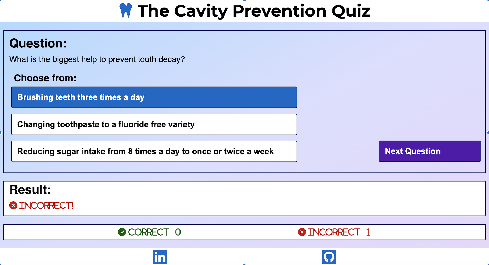

- a Score area which keeps a tally of correct and incorrect answers

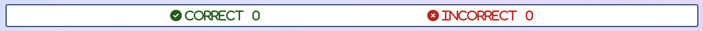

- When the game finishes, another window opens to
  - give the users their final score
  - along with some personalised feedback
  - and invites them to refresh the game

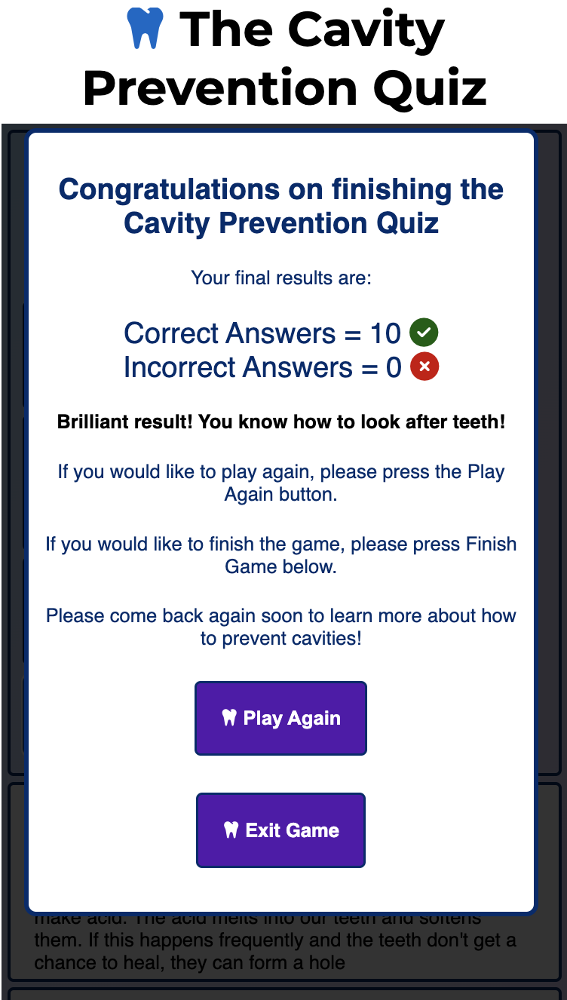

### Future Implementations

1. If time allowed, I would like to have a progress bar displayed so the player could tell how many questions they had to go.
2. An 'easy', 'moderate' and 'difficult' mode would be helpful to make the game even more useful for people of different knowledge levels.
3. Scrambling the order of the answers would also make the game more helpful for repeat users.
4. Adding game sounds and animations would increase interest and novelty.

### Accessibility

I have tried to be inclusive for everyone when coding this website by

- Using aria labels when appropriate for people using screen readers.

- The EightShapes Contrast Grid was helpful with matching background and text colours with good contrast and making sure text is an appropriate size on all types of screen.

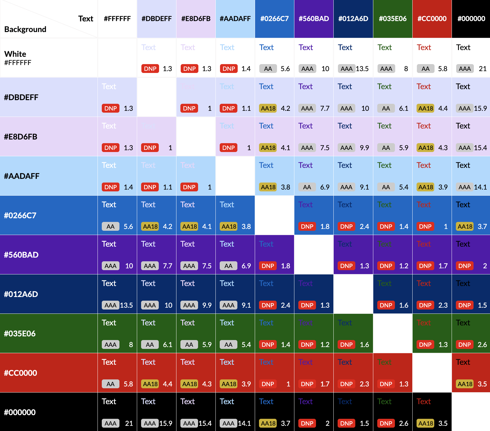

- Using semantic HTML as much as possible.

- Testing the website with Wave and Lighthouse.

## Technologies Used

### Languages Used

This website was made using JavaScript, HTML and CSS.

### Frameworks, Libraries & Programs Used

[Balsamiq](https://balsamiq.com/givingback/free/classroom/) - Used to create wireframes.

[Github](https://github.com/Code-Institute-Org/ci-full-template) - To save and store files for the website.

[Codeanywhere](https://dashboard.codeanywhere.com/) - To write the code.

[Google Fonts](https://fonts.google.com/) - To import the fonts used.

[Font Pair](https://www.fontpair.co/all) - To find a complementary font pairing.

[Font Awesome](https://fontawesome.com/) - For the icons and the favicon.

[Coolors](https://coolors.co/) - For inspiration for a colour palette.

[Art In Context](https://artincontext.org/color-palette-generator/) - To build a custom colour palette.

[EightShapes Contrast Grid](https://contrast-grid.eightshapes.com/) - To improve accessibilty with colours.

Google Chrome Development Tools - To test the code as I was writing it, and to troubleshoot and isolate issues with styling, as well as test accessibilty with Lighthouse.

[Wave](https://wave.webaim.org/) - To evaluate accessibility.

[Convertio](https://convertio.co/) - To convert images to webp format.

[Favicon](https://favicon.io/) - To convert the favicon from an icon.

[Am I Responsive?](https://ui.dev/amiresponsive) - To display the website on a range of screen sizes.

[Shields](https://shields.io) - To display badges in this README.md document.

## Deployment & Local Development

### Deployment

Github Pages was used to deploy the live website. The instructions to achieve this are:

1. Log in (or sign up) to Github.
2. Find the repository for this project, kellie-cat/dental-quiz.
3. Click on the Settings link.
4. Click on the Pages link in the left hand side navigation bar.
5. In the Source section, ensure Deploy from a branch is selected, and choose main from the drop down select branch menu. Select Root from the drop down select folder menu.
Click Save.
Your live Github Pages site is now deployed at the URL shown.

### Local Development

#### How to Fork

To fork the Cavity Prevention Quiz:

1. Log in (or sign up) to Github.
2. Go to the repository for this project, kellie-cat/dental-quiz.
3. Click the Fork button in the top right corner.

#### How to Clone

To clone the Cavity Prevention Quiz:

1. Log in (or sign up) to GitHub.
2. Go to the repository for this project, kellie-cat/dental-quiz.
3. Click on the code button, select whether you would like to clone with HTTPS, SSH or GitHub CLI and copy the link shown.
4. Open the terminal in your code editor and change the current working directory to the location you want to use for the cloned directory.
5. Type 'git clone' into the terminal and then paste the link you copied in step 3. Press enter.

## Testing

The website was tested as it was built on Google Chrome using Google Devtools. It was designed with a mobile-first mindset and other screensizes were adjusted using media queries. Other browsers were tested.

HTML validator was used to check all of the HTML and the CSS on the site.

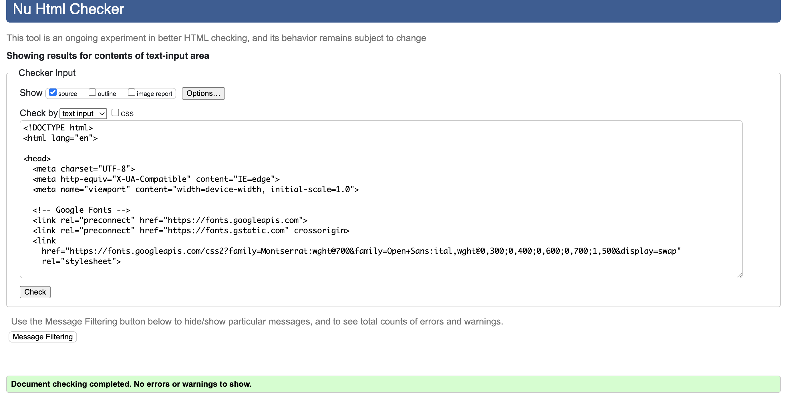
Home page validation

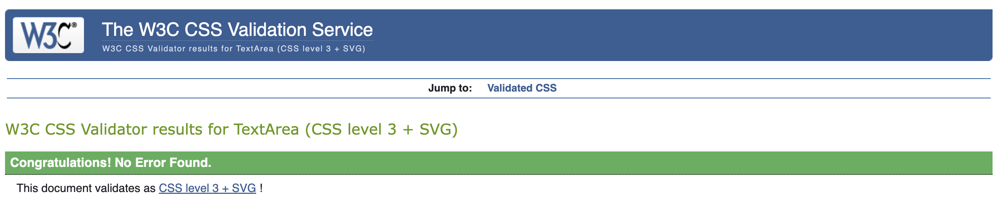
CSS validation

### Resolved Bugs

Many issues were discovered and resolved throughout the project.

1. Trial and error and patience are key for JavaScript. Many times I tried many lines of code that did not work. I learned to just keep trying.
2. I thought I had correctly programmed the correct and incorrect scores to increment... only to discover the incorrect score kept going up if the user clicked on the wrong answer again. I fixed this issue by disabling the incorrect buttons when they were tried once.
3. I wanted to highlight the feedback area when it was given, and tried to add animation. This proved difficult as I am not familiar with JavaScript libraries and frameworks yet. I eventually settled on a simpler CSS animation.

### Known Bugs

There are no unfixed bugs on the Cavity Prevention Quiz.

## Credits

### Code Used

- [Kera Cudmore's README.md for the Bully Book Club](https://github.com/kera-cudmore/Bully-Book-Club)
- [W3schools for the Fisher Yates Shuffle Method](https://w3schoolsua.github.io/js/js_array_sort_en.html#gsc.tab=0)
- [Alvarotrigo for the CSS animation](https://alvarotrigo.com/blog/css-text-animations/)

### Content

Content was written by Kellie McConnell BA BDentSc 2011 MFD 2013 MSc Advanced Minimum Intervention Dentistry 2020.

### Acknowledgments

Thank you so much to everyone who helped me in this project.

- David Bowers, my Code Institute Mentor, thank you for your understanding and kind approach. You are a wonderful teacher.

- My husband, William Wong, for feeding me and giving me peace to code.
